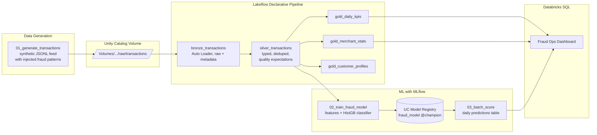

# Fraud Detection Lakehouse on Databricks Free Edition

An end-to-end financial-services lakehouse built entirely on the **free** Databricks tier:
synthetic card-transaction data flows through a medallion architecture (Bronze → Silver → Gold),
a fraud-detection model is trained and registered with MLflow, and results land in a
Databricks SQL dashboard. Everything — data generation, pipelines, ML, BI — runs inside
one Free Edition workspace with zero cloud spend.

## Architecture



## What this showcases

| Skill area | Where |
|---|---|
| Medallion architecture on Delta Lake | `pipelines/fraud_pipeline.py` |
| Incremental ingestion with Auto Loader | Bronze table (`cloudFiles` over a UC Volume) |
| Data quality as code (expectations) | Silver table (`expect_or_drop` rules) |
| Unity Catalog governance | Catalog/schema/volume setup, registered model |
| Feature engineering with Spark window functions | `notebooks/02_train_fraud_model.py` |
| MLflow tracking + UC Model Registry + aliases | Training & scoring notebooks |
| Batch inference pattern (free-tier friendly) | `notebooks/03_batch_score.py` |
| Analytics engineering / BI | `sql/dashboard_queries.sql` |
| Infrastructure as code | `databricks.yml` (Databricks Asset Bundle) |

## The use case

Card-transaction fraud detection — the canonical FSI lakehouse workload. The synthetic
generator (built from scratch, no external dataset needed) simulates ~2,000 customers with
realistic behavior (home country, favorite merchants, diurnal activity, log-normal amounts)
and injects three fraud patterns at a ~0.4% rate:

1. **Card testing** — bursts of tiny online transactions minutes apart
2. **Account takeover** — sudden high-value spending from a foreign country on a new device
3. **Merchant collusion** — repeated near-threshold amounts at a compromised merchant

It also injects *dirty data* (duplicates, null fields, malformed amounts) so the Silver
layer's quality expectations have real work to do.

## Repo layout

```
notebooks/
  _config.py                   Single source of truth: names, paths, thresholds
  _features.py                 Shared point-in-time feature engineering (train + score)
  00_setup_catalog.py          Create schema + raw volume in Unity Catalog
  01_generate_transactions.py  Synthetic feed: daily JSONL files into the volume
  02_train_fraud_model.py      Champion/challenger training, MLflow, UC registry
  03_batch_score.py            @champion batch inference, idempotent MERGE
  04_model_monitoring.py       PSI drift + alert precision/recall metrics
pipelines/
  fraud_pipeline.py            Lakeflow declarative pipeline (Bronze/Silver+quarantine/Gold)
sql/
  dashboard_queries.sql        12 queries for the 4-section Fraud Ops dashboard
docs/
  SETUP.md                     Step-by-step Free Edition walkthrough
  architecture.md              Layer contracts, ML design, prod-scale deltas
  RUNBOOK.md                   Operational playbooks (failures, backfill, rollback)
  adr/                         Architecture decision records (4)
databricks.yml                 Asset Bundle: pipeline + daily job + weekly retrain
.github/workflows/ci.yml       Lint + syntax + bundle validation
```

## Quickstart

1. Sign up for [Databricks Free Edition](https://www.databricks.com/learn/free-edition)
2. Push this repo to GitHub, then add it as a **Git folder** in your workspace
3. Follow [docs/SETUP.md](docs/SETUP.md) — run order, pipeline creation, dashboard import

**New to Databricks or lakehouse concepts?** Start with
[docs/CONCEPTS.md](docs/CONCEPTS.md) — every concept this project uses
(lakehouse, Delta, medallion, Auto Loader, expectations, MLflow, leakage,
PR-AUC, PSI, bundles…) explained for beginners, in the order you'll meet them,
each tied to the exact place it appears in this repo.

## Free-tier design decisions

Every choice here is deliberate for Free Edition (see `docs/adr/`):

- **Synthetic data generator** instead of Kaggle downloads — self-contained, rerunnable, and lets Auto Loader see genuinely incremental file arrivals
- **UC Volumes** as the landing zone — Free Edition has no external cloud storage
- **Serverless everything** — Free Edition offers serverless compute only
- **Batch scoring** instead of Model Serving endpoints — real-time serving is limited on the free tier; the daily-batch pattern is also what most fraud-ops teams actually run for review queues
