# Concepts — a beginner's guide to everything this project uses

Read this top to bottom before (or alongside) [SETUP.md](SETUP.md). Concepts
are ordered the way you meet them in the project: platform → data engineering
→ machine learning → operations.

Every section has: a plain-language explanation, a **worked example with real
numbers or data**, usually a **diagram** (GitHub renders these natively),
**In this project** (where it lives in the repo), and **See it yourself**
(how to observe it in your workspace).

**Contents**
- [Part 1 — The platform](#part-1--the-platform): Databricks · Lakehouse · Delta Lake · Unity Catalog · Serverless
- [Part 2 — Data engineering](#part-2--data-engineering): Medallion · Auto Loader · Streaming & watermarks · Declarative pipelines · Expectations & quarantine · Materialized views
- [Part 3 — Machine learning](#part-3--machine-learning): Features · Leakage · Time splits · Imbalance & metrics · The two models · MLflow · Champion/challenger · Batch scoring · Drift & PSI
- [Part 4 — Operations](#part-4--operations): Jobs · Asset Bundles · CI & runbooks
- [Glossary](#quick-glossary)

**A trick this guide uses throughout:** we follow **one transaction** — a
card-testing fraud attempt — through the entire system, from raw JSON to a
dashboard alert. Watch for the 📍 marker.

📍 Here it is, as it lands in the raw feed (one line of a JSONL file):

```json
{"transaction_id": "7f3a9c...", "event_ts": "2026-06-15T02:47:11",
 "customer_id": "C01342", "merchant_id": "M0219", "merchant_category": "online_services",
 "amount": 1.20, "currency": "USD", "country": "IN", "device_id": "D4e91ab22f0",
 "channel": "online", "is_fraud": 1, "fraud_type": "card_testing"}
```

A ₹/$1.20 online charge at 02:47 — the 9th such tiny charge from this customer
in 20 minutes. A fraudster is testing whether a stolen card works before making
a real purchase. Keep this row in mind.

---

## Part 1 — The platform

### 1.1 What is Databricks?

Databricks is a cloud platform for working with data at any scale. Under the
hood it runs **Apache Spark**, a distributed compute engine: when you run code
on a 100-million-row table, Spark automatically splits the work across many
machines and combines the results. You never write the "distribute" part —
you write normal-looking Python/SQL and Spark parallelizes it.

Around that engine, Databricks packages what traditionally required four
separate products:

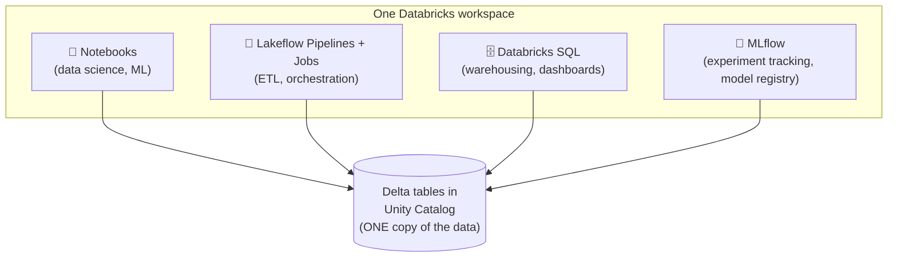

| You'd traditionally buy… | In Databricks it's… | In this project |
|---|---|---|
| Data warehouse (Snowflake, Teradata) | Databricks SQL + Delta tables | the dashboard queries |
| Data lake (raw files on S3) | Volumes + Delta Lake | the JSONL landing zone |
| ETL tool (Informatica, Airflow) | Lakeflow pipelines + Jobs | `fraud_pipeline.py`, the daily job |
| ML platform (SageMaker) | Notebooks + MLflow | notebooks 02–04 |

The key architectural point is the single arrow target: **all four consumers
read the same tables**. No nightly copy from the lake to the warehouse, no
"the ML team's numbers don't match the BI team's numbers."

### 1.2 What is a *lakehouse*?

The word is a merge of data **lake** and ware**house**, and so is the idea.

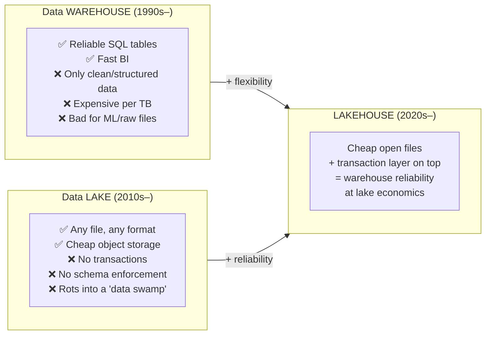

**Worked example of the problem lakehouses solve.** A bank keeps transactions
as plain Parquet files in a lake. Two things go wrong constantly:

1. An ETL job crashes halfway through writing 500 files. Now the folder holds
   250 new files and 250 missing ones. Every query until someone notices
   returns silently wrong totals. *(No transactions.)*
2. A producer team changes `amount` from a number to a string in their export.
   Nothing fails at write time — but every downstream `SUM(amount)` breaks
   days later. *(No schema enforcement.)*

The lakehouse fix is not "buy a warehouse too" (now you have two copies and a
sync problem) — it's adding a small transaction layer over the same cheap
files. That layer is Delta Lake.

**In this project:** the entire design. Raw JSON lands as files, becomes
reliable tables, and the *same* tables feed the SQL dashboard and the ML model.

### 1.3 Delta Lake

A Delta table is just a folder — Parquet data files plus a `_delta_log/`
subfolder of JSON commit records:

```
silver_transactions/
├── _delta_log/
│   ├── 00000000000000000000.json   ← commit 0: created table, added 2 files
│   ├── 00000000000000000001.json   ← commit 1: added file-003 (day-2 ingest)
│   └── 00000000000000000002.json   ← commit 2: removed file-001, added file-004 (a MERGE)
├── part-00001.snappy.parquet
├── part-00002.snappy.parquet
├── part-00003.snappy.parquet
└── part-00004.snappy.parquet
```

A reader's rule: *the table is whatever the log says it is.* That one rule
delivers everything:

- **ACID transactions.** A write only "happens" when its commit file lands in
  the log — atomically. The crashed-halfway ETL job above? Its 250 files exist
  on disk but no commit references them, so readers never see them. The table
  is never half-written.
- **Schema enforcement.** The log stores the schema; a write with `amount` as
  STRING into a DOUBLE column is *rejected at write time*, when the producer
  can still fix it — not discovered at read time weeks later.
- **Time travel.** Old commits are retained, so you can read the past:

  ```sql
  SELECT COUNT(*) FROM silver_transactions VERSION AS OF 12;
  SELECT * FROM silver_transactions TIMESTAMP AS OF '2026-06-20';
  -- "what did the fraud rate look like before yesterday's backfill?"
  ```
- **MERGE (upsert).** Update-if-exists, insert-if-new, as one transaction —
  the workhorse of section 3.8.

**In this project:** every table is a Delta table. Notice you never say
"Delta" anywhere — it's simply the default.
**See it yourself:** Catalog → `silver_transactions` → **History** tab. Every
pipeline update is a numbered commit with its operation, timestamp and row
counts. That's the `_delta_log` rendered as UI.

### 1.4 Unity Catalog (UC)

The governance layer — one tree that answers *what data exists, who may touch
it, and where did it come from?*

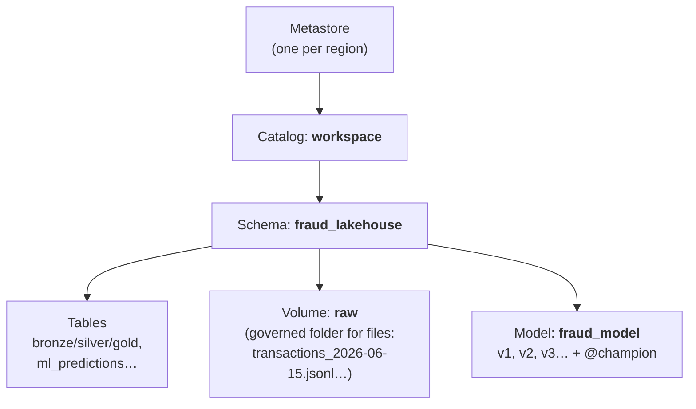

Everything gets a three-part address, and the address is how you refer to it
*everywhere* — SQL, Python, permissions, lineage:

```
workspace  .  fraud_lakehouse  .  silver_transactions
 catalog        schema               object
```

Governance then hangs off the names. Two examples you'd run in a real bank
(not needed on a single-user Free Edition workspace, but this is the point of
UC):

```sql
-- analysts may read gold, but never raw cardholder data
GRANT SELECT ON workspace.fraud_lakehouse.gold_daily_kpis TO `fraud_analysts`;
-- the scoring job's service principal may read the model
GRANT EXECUTE ON MODEL workspace.fraud_lakehouse.fraud_model TO `svc_scoring`;
```

Note that **files** (the volume) and **models** live in the same tree as
tables — one permission system for all three, which is unusual and valuable.

**In this project:** `00_setup_catalog.py` creates the schema + volume; every
name is defined once in `_config.py` and imported everywhere else.
**See it yourself:** Catalog → `silver_transactions` → **Lineage** tab: it
shows the three gold tables and the pipeline that produced it — computed
automatically from query history, not documented by hand.

### 1.5 Serverless compute

Classically you configure Spark **clusters**: instance types, node counts,
autoscaling ranges, idle timeouts, runtime versions. It's a skill of its own
and the top source of both cost overruns and "cluster is starting…" waits.

**Serverless** deletes the whole topic: you run a notebook or pipeline and
compute appears in seconds, scales itself, and disappears. You manage nothing.

**In this project:** Free Edition is serverless-*only*, which conveniently
forces the modern pattern — there is not a single cluster config anywhere in
this repo. Compare any pre-2024 Databricks tutorial to see how much YAML you
were spared.

---

## Part 2 — Data engineering

### 2.1 Medallion architecture (Bronze / Silver / Gold)

The standard lakehouse pattern: data flows through three layers of increasing
quality, like ore being refined.

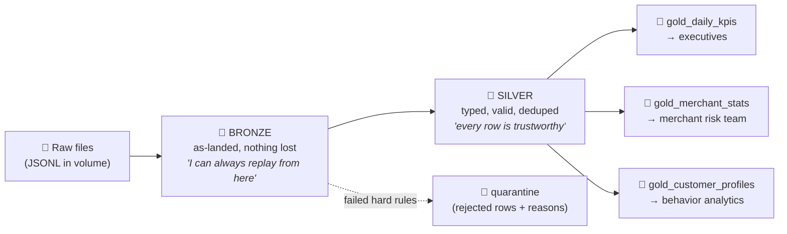

**Why not clean the data in one step?** Because you *will* get cleaning wrong,
and requirements *will* change. Suppose a month in, you discover your dedup
logic was too aggressive and dropped legitimate repeat purchases. With Bronze
preserved: fix the logic, rebuild Silver from Bronze, done. Without Bronze:
that data is gone forever. Bronze is cheap insurance (storage costs almost
nothing); destroyed data is unrecoverable.

📍 **Our transaction through the layers:**

| Layer | What happens to it | Its shape |
|---|---|---|
| File | Lands inside `transactions_2026-06-15.jsonl` | one JSON line |
| Bronze | Stored as-is + `_source_file`, `_ingested_at` added | strings/inferred types, warts and all |
| Silver | `event_ts` cast to TIMESTAMP, `amount` verified `> 0`, checked not-a-duplicate | one clean typed row, PK = transaction_id |
| Gold | Counted into `gold_daily_kpis` for 2026-06-15 (fraud_count +1) and into `gold_merchant_stats` for M0219 | aggregated — the row itself no longer visible |

Notice each layer serves a different reader: an auditor investigating "what
exactly did we receive on June 15?" reads Bronze. The ML model trains on
Silver. The COO's dashboard reads Gold. Nobody argues about whose numbers are
right, because everyone can trace their layer back to the same Bronze.

**In this project:** `pipelines/fraud_pipeline.py` — one file, all layers.
Read it top to bottom and notice Bronze does *no validation at all*. That's
not laziness; that's the contract.

### 2.2 Auto Loader & incremental ingestion

The naive way to ingest a folder re-reads **everything, every run**:

```python
spark.read.json("/Volumes/.../transactions/")   # day 30: reads 30 files. day 300: reads 300.
```

Cost grows forever, and every rerun duplicates every row. **Auto Loader**
(`format("cloudFiles")`) instead keeps a **checkpoint** — a little ledger of
files already processed — and each run ingests only what's new, exactly once:

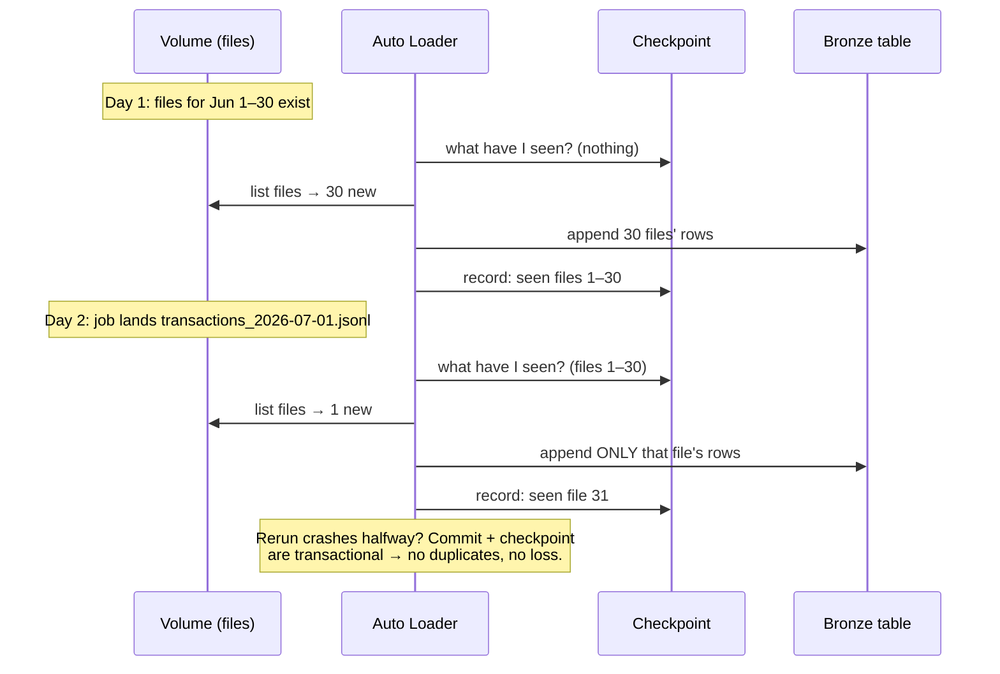

**Schema handling.** What if a file suddenly contains `"amount": "12.50"`
(string) or a brand-new field `"card_present": true`? Failing the 3am pipeline
is the worst answer. With `schemaEvolutionMode: rescue`, anything that doesn't
fit the expected schema is captured in a `_rescued_data` column as JSON:

| transaction_id | amount | _rescued_data |
|---|---|---|
| 7f3a9c… | 1.20 | null |
| 88b1d2… | null | `{"amount": "twelve"}` ← malformed, preserved not crashed |

The pipeline keeps running; the weird rows are preserved for investigation.

**In this project:** the Bronze definition in `fraud_pipeline.py`. The
generator writes one file per day *specifically* so you can watch this work.
**See it yourself:** after a daily job run, open the pipeline event log —
Bronze reports ingesting 1 file, not 31.

### 2.3 Streaming, watermarks, and deduplication

Bronze→Silver runs as **Structured Streaming**. Mental model shift:

- *Batch*: "process this dataset" — you re-decide what to process every time.
- *Streaming*: "process whatever arrives, forever" — declared once; each
  triggered run processes the increment. (A "stream" can perfectly well run
  once a day — streaming is about *incremental semantics*, not about speed.)

**The dedup problem.** Our feed contains ~0.5% duplicate `transaction_id`s
(injected deliberately — real feeds duplicate on retries). To drop them, Spark
must remember every ID it has ever seen… which grows forever. Unbounded state
eventually kills any streaming job.

**The watermark fix.** You declare a business assumption: *"a duplicate only
ever arrives within 2 days of the original."* Spark then only remembers 2 days
of IDs and forgets the rest:

```
state Spark keeps:            forgotten (before watermark)   remembered
                              ─────────────────────────────┬──────────────────────
event time ──────────────────────────────────────────────► │
            Jun 1 ......................... Jun 28   Jun 29 │ Jun 30    Jul 1 (now)
                                                            ▲
                                          watermark = max event_ts seen − 2 days

dup of a Jun 30 txn arriving Jul 1  → caught ✅ (in state)
dup of a Jun 5 txn arriving Jul 1   → passes ❌ (state forgotten — accepted trade-off)
```

```python
.withWatermark("event_ts", "2 days")
.dropDuplicatesWithinWatermark(["transaction_id"])
```

That's the general shape of streaming design: **bounded memory in exchange for
an explicit assumption about lateness.** The assumption is a business decision
and belongs in review, not buried in code.

**In this project:** the Silver definition. 📍 If our card-testing transaction
arrived twice (a retry), the second copy dies here.

### 2.4 Declarative pipelines (Lakeflow / DLT)

Two philosophies for building the medallion:

**Imperative** — you write *how*:

```python
# you own: execution order, checkpoints, table creation, retries, backpressure…
df = spark.readStream.format("cloudFiles")...load(path)
df.writeStream.option("checkpointLocation", "/chk/bronze").toTable("bronze")
# ...wait for bronze before starting silver? handle its checkpoint? and so on
```

**Declarative** — you write *what should exist*:

```python
@dlt.table(name="silver_transactions")
def silver():
    return dlt.read_stream("bronze_transactions").where(...)   # ← this read IS the dependency declaration
```

Because `silver()` *reads* `bronze_transactions`, the framework knows silver
depends on bronze — from the code itself. It assembles the whole graph
(**DAG** — directed acyclic graph), runs things in order, parallelizes
independent branches (the three gold tables build concurrently), and manages
every checkpoint:

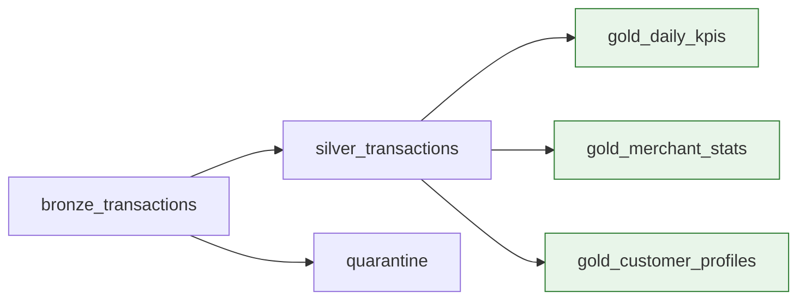

The same shift as SQL ("say what you want, the optimizer finds how") and
Terraform ("declare the infra, the engine converges to it"), applied to
pipelines.

**See it yourself:** open the pipeline UI — that DAG picture was never drawn
by anyone. It's derived from the code. Delete a `dlt.read` and watch an edge
disappear.

### 2.5 Data quality: expectations & quarantine

An **expectation** is a named quality rule attached to a table. This project
uses two severities, and the distinction is the design:

```python
HARD_RULES = {   # violation breaks downstream logic → drop the row (but keep it! see below)
    "valid_transaction_id": "transaction_id IS NOT NULL",   # can't dedup/join a null PK
    "valid_amount": "amount IS NOT NULL AND amount > 0",     # would poison SUMs and features
    ...
}
SOFT_RULES = {   # imperfection worth tracking, not blocking → let it pass, count it
    "known_merchant": "merchant_id IS NOT NULL",
    "known_currency": "currency IN ('USD')",
}
```

Here's a real batch of generator output flowing through the gate:

| row | amount | merchant_id | txn_id | hard rules | soft rules | destination |
|---|---|---|---|---|---|---|
| A | 42.10 | M0219 | ok | ✅ | ✅ | Silver |
| B | 8.75 | **null** | ok | ✅ | ⚠️ known_merchant | Silver (counted) |
| C | **−13.20** | M0102 | ok | ❌ valid_amount | — | **Quarantine**, reason=`valid_amount` |
| D | **"12.50"** (string) | M0044 | ok | ❌ valid_amount (cast→null) | — | **Quarantine**, reason=`valid_amount` |

The crucial rule: **"dropped" must never mean "vanished."** Rows C and D land
in `silver_transactions_quarantine` with a `_quarantine_reason` column, and the
dashboard trends the daily quarantine count by reason. When an upstream system
breaks and starts sending negative amounts, you see a spike *on a chart* —
instead of numbers being quietly wrong. That's the difference between a
quality gate and a silent data shredder.

(And note the operational discipline in the [RUNBOOK](RUNBOOK.md): when the
quarantine spikes, you fix the *producer* or consciously amend the contract —
never quietly loosen a rule to make the chart look better. The rule was
catching something.)

**In this project:** the `HARD_RULES`/`SOFT_RULES` dicts drive *both* the
Silver expectations *and* the quarantine's inverse filter — one definition,
two uses, impossible to drift apart.

### 2.6 Materialized views (the Gold layer)

A regular view re-runs its query on every read. A **materialized view**
stores the result, and the pipeline keeps it fresh.

Back-of-envelope: the exec dashboard shows daily KPIs and gets opened ~50
times a day. As a plain view over Silver, that's 50 full-table aggregations
of (eventually) millions of rows, every day, forever — with users watching a
spinner each time. As a materialized view, the aggregation happens once per
pipeline update; the dashboard reads ~30 precomputed rows instantly.

Classic trade, worth internalizing because it's everywhere in data
engineering: **pay at write time, serve cheap at read time.**

**In this project:** all three gold tables. 📍 Our transaction is now one
count inside `gold_daily_kpis` for June 15 (`fraud_count` +1, `txn_count` +1)
— individually invisible, but present in the numbers an executive sees.

---

## Part 3 — Machine learning

### 3.1 Features & feature engineering

Models don't understand "transactions" — they understand vectors of numbers. A
**feature** is one numeric signal derived from raw data, and feature
engineering is where *domain knowledge* enters: each of our features encodes a
belief about how fraud behaves.

📍 Our card-testing transaction, converted to its feature vector:

| Feature | Value | The fraud intuition it encodes |
|---|---|---|
| `amount` | 1.20 | testing charges are tiny |
| `log_amount` | 0.79 | compresses the huge amount range for the model |
| `hour` / `is_night` | 2 / 1 | fraud skews to when victims sleep |
| `is_online` | 1 | card-testing is an online crime |
| `is_foreign` | 0 | (this pattern doesn't need geo) |
| `is_new_device` | 1 | fraudster's device, first time seen for C01342 |
| **`txn_count_1h`** | **8** | ← the smoking gun: 9th txn in an hour for a ~2/day customer |
| `txn_count_24h` | 9 | same signal, wider window |
| `amount_over_avg` | 0.03 | 1.20 vs this customer's ~₹/$40 average |
| `seconds_since_prev_txn` | 154 | 2½ minutes since the previous attempt |
| `merchant_fraud_rate` | 0.011 | this merchant has seen fraud before |

A human analyst looking at that row would say "obvious card testing." The
features are that analyst's reasoning, written as arithmetic. When later the
model catches this transaction, it won't be magic — it will be `txn_count_1h=8`
plus `amount=1.20` plus `is_new_device=1` firing together.

**In this project:** `notebooks/_features.py` — every feature has its window
and its rationale in comments.

### 3.2 Data leakage & point-in-time correctness

**The most important ML concept in this repo.** Leakage = training on
information that won't exist at prediction time. The model looks brilliant in
evaluation and useless in production — the most expensive failure mode in
applied ML because you discover it *after* deploying.

A concrete leak, with our data. Say we compute `amount_over_avg` using each
customer's average over **all 30 days**, then train on days 1–24:

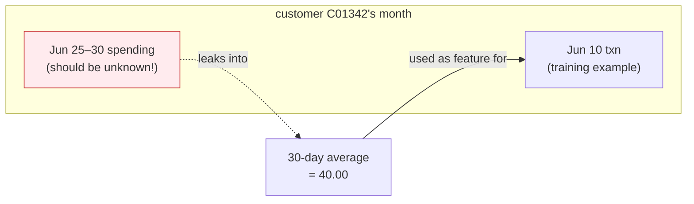

The June 10 training example now "knows" June 25–30 spending — information
from its future. Evaluation metrics inflate (test rows' history overlaps what
training averaged over), and in production — where the future genuinely
doesn't exist yet — performance craters to the honest level. You shipped a
mirage.

**The fix — point-in-time correctness:** every feature for a transaction uses
only data *strictly before* that transaction. In `_features.py` every window
ends at −1 (row or second):

```python
w_hist = w_cust.rowsBetween(Window.unboundedPreceding, -1)   # everything BEFORE this txn
w_1h   = w_cust.rangeBetween(-3600, -1)                      # the hour BEFORE this txn
```

Same reasoning, one level up: `merchant_fraud_rate` is computed on the
**training window only** and frozen as a snapshot table. Recomputing it on
test data would bake test *labels* into a feature — the same leak wearing a
different coat.

**Interview tip:** "how do you prevent leakage in time-series features?" is a
standard ML interview question. This repo *is* the answer: windows ending at
−1, frozen feature snapshots, and a time-based split (next section).

### 3.3 Time-based splits

To evaluate a model you hold out a **test set** it never trained on. The
default habit — random 80/20 — is wrong for fraud:

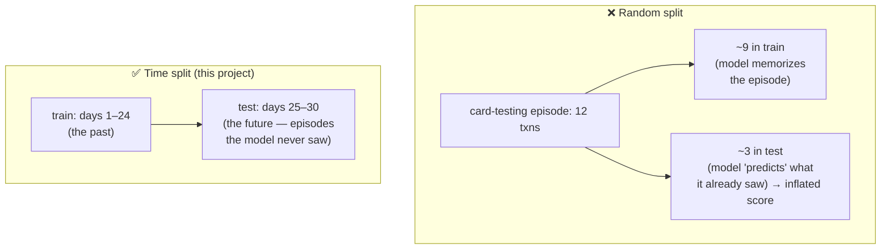

Fraud arrives in *episodes* — our card-testing burst is 8–20 related rows. A
random split scatters each episode across both sides, so the model is tested
on fragments of events it partially memorized. A **time split** matches the
production question exactly: *given the past, catch future fraud.*

**In this project:** `TRAIN_TEST_SPLIT_DAY = 24` in `_config.py`; the split is
on `event_ts`, never `random_state`.

### 3.4 Class imbalance — and why accuracy is a lie here

~0.4% of our transactions are fraud. Follow the arithmetic on one day of
50,000 transactions, 200 of them fraud:

**The useless model** — always answers "not fraud":
- correct on 49,800 legit + 0 fraud → **accuracy = 99.6%** 🎉 …and catches nothing.

**A genuinely good model** — flags 250 transactions, 150 of them actual fraud:

|  | flagged | not flagged |
|---|---|---|
| **fraud (200)** | 150 ✅ true positive | 50 ❌ false negative (missed fraud) |
| **legit (49,800)** | 100 ❌ false positive (annoyed analyst) | 49,700 ✅ true negative |

- **Precision** = 150/250 = **60%** — of what we flag, how much is real? (low → analysts drown in false alarms and start ignoring the queue)
- **Recall** = 150/200 = **75%** — of real fraud, how much do we catch? (low → losses walk out the door)
- **Accuracy** = 49,850/50,000 = **99.7%** — barely distinguishable from the useless model. That's why we never report it.

Two more metrics, both tied to *decisions*:

- **PR-AUC** — every alert threshold gives a different precision/recall pair;
  PR-AUC summarizes the whole trade-off curve in one number. Our headline
  training metric.
- **Precision@200** — precision within the top-200 daily alerts, because the
  ops team can review ~200 cases/day (`MAX_DAILY_ALERTS` in `_config.py`).
  A model can have beautiful curves and still waste the analysts' morning;
  this metric can't be gamed that way. **Choose metrics that mirror the
  business constraint.**

Finally, training itself must respect the imbalance: with 0.4% positives the
loss function barely notices fraud. We weight each fraud example by
`(1−0.004)/0.004 ≈ 249×`, making 200 fraud rows "worth" ~49,800 — the two
classes now pull on the model equally.

### 3.5 The two models (and why there are two)

**Logistic regression** — the classic linear baseline. Learns one weight per
feature; the prediction is essentially a weighted checklist
(`8·w_velocity + 1·w_new_device + … → probability`). Fast, stable,
explainable to a regulator.

**Gradient boosting** (`HistGradientBoostingClassifier`) — an *ensemble* of
hundreds of small decision trees built sequentially, each one trained on the
errors of everything before it:

```
tree 1: "amount < 3 AND txn_count_1h > 5 → probably fraud"   (a crude rule)
tree 2: trained on tree 1's mistakes → "…but not if merchant is the customer's regular"
tree 3: trained on the remaining mistakes → picks up the ATO pattern instead
...   × 300 rounds, each correcting the last  → one strong model from many weak rules
```

Boosting captures *interactions* (tiny amount is only suspicious **combined
with** high velocity **and** a new device) that a linear model can't. It's the
default winner on tabular data — but that's an empirical claim, so we verify
it: **the baseline anchors whether the complex model earns its complexity.**
If boosting beats logistic regression by a hair, ship the simple one — it's
cheaper to run, easier to debug, and explainable for compliance.

### 3.6 MLflow: experiments, registry, aliases

Without tracking, ML devolves into `model_final_v3_REAL_fixed.pkl` and nobody
can say which code produced the model in production. MLflow adds three layers:

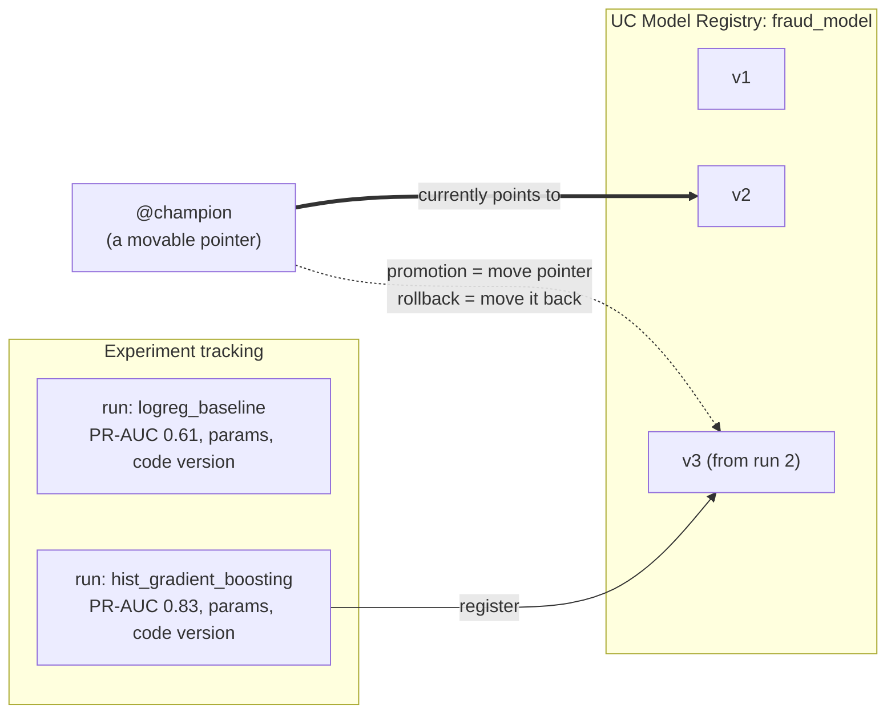

- **Experiment tracking** — every training run permanently records its
  parameters, metrics, environment and model artifact. Any two runs are
  comparable side-by-side, forever.
- **Model registry** — a trained model becomes a governed, versioned UC
  object: `workspace.fraud_lakehouse.fraud_model` v1, v2, v3…
- **Aliases** — the production insight. Scoring code says:

  ```python
  mlflow.sklearn.load_model("models:/workspace.fraud_lakehouse.fraud_model@champion")
  ```

  It names the **alias, never a version number**. Deploying a new model =
  move the pointer. Rolling back a bad one = move it back. **No code change,
  no redeploy, one line** (that line is playbook 5 in the RUNBOOK).

### 3.7 Champion/challenger

The production answer to "is the new model actually better?" — as a gate in
code, not a judgment call:

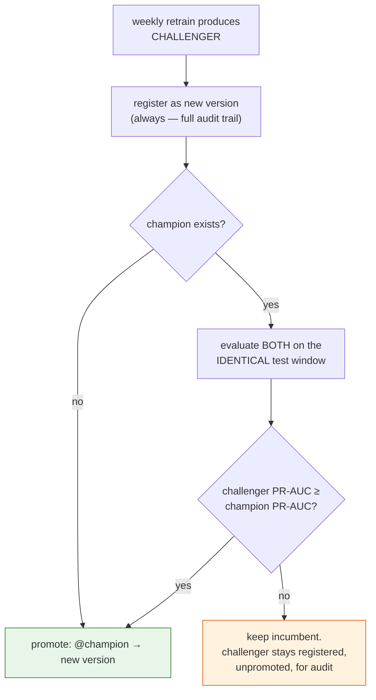

Example: champion v2 scores PR-AUC **0.83** on the test window. Sunday's
retrain produces v3 at **0.81**. v3 is registered (you can always audit what
was trained) but `@champion` doesn't move — Monday's scoring uses v2, and no
human had to make, or defend, that call at 6pm on Friday.

The two details that make the comparison fair: same test window for both, and
a required margin (`MIN_PROMOTION_GAIN` in `_config.py`) if you want wins to
be *meaningful*, not noise.

**See it yourself:** run `02_train_fraud_model.py` twice — the second run
prints either `PROMOTED …` or `NOT promoted …` with both scores.

### 3.8 Batch scoring & idempotency

**Batch vs real-time.** Real card fraud systems have two scoring layers:
*authorization-time* (approve/decline in <100 ms while the card is in the
terminal — online feature stores, low-latency serving) and *detection-time*
(score the day's transactions, feed a human review queue, drive retraining).
This project implements the second; [ADR-0003](adr/0003-batch-scoring-over-model-serving.md)
explains why, and `architecture.md` sketches where the first would attach.

**Idempotency** = running twice gives the same result as once. It's *the*
property that makes 3am operations survivable, and here it comes from writing
predictions via `MERGE` keyed on `transaction_id`. Watch it absorb a rerun
after the rollback scenario from 3.6 — say v3 briefly scored June 15 before
being rolled back to v2, and we re-score:

**Before re-score** (v3's output):

| transaction_id | fraud_score | is_alert | model_version |
|---|---|---|---|
| 7f3a9c… 📍 | 0.91 | 1 | 3 |
| 2c11e0… | 0.34 | 0 | 3 |

**After re-scoring the same day with v2** — same rows *updated*, not duplicated:

| transaction_id | fraud_score | is_alert | model_version |
|---|---|---|---|
| 7f3a9c… 📍 | 0.94 | 1 | **2** |
| 2c11e0… | 0.12 | 0 | **2** |

An append instead of a MERGE would have left both copies — double-counted
alerts, a corrupted review queue, and a dashboard nobody trusts. Note also
`model_version` stamped on every row: any historical alert can be traced to
the exact model that raised it. Auditors ask exactly this.

📍 Our transaction scores **0.94** — the review queue (dashboard query 3)
shows it near the top of June 15's alerts. The burst pattern the features
encoded in 3.1 is what fired.

### 3.9 Drift & PSI

Models decay because the world changes: fraudsters adapt to what gets caught,
customer behavior shifts, an upstream system changes a field's meaning.
**Drift** = today's data no longer resembles the data the model was trained
on. You want an alarm *before* the precision chart sags.

Our alarm watches the **score distribution**. At training time we snapshot a
histogram of the model's scores (the *baseline*); every day we compare the
day's histogram against it with **PSI (Population Stability Index)**.

Follow one full calculation — 5 buckets, baseline vs a drifted day:

| score bucket | expected % (baseline) | actual % (today) | (a−e) | ln(a/e) | contribution |
|---|---|---|---|---|---|
| 0.0–0.2 | 70% | 55% | −0.15 | −0.241 | 0.036 |
| 0.2–0.4 | 15% | 20% | +0.05 | +0.288 | 0.014 |
| 0.4–0.6 | 8% | 10% | +0.02 | +0.223 | 0.004 |
| 0.6–0.8 | 5% | 9% | +0.04 | +0.588 | 0.024 |
| 0.8–1.0 | 2% | 6% | +0.04 | +1.099 | 0.044 |
| | | | | **PSI = Σ** | **0.122** |

Each row: `(actual − expected) × ln(actual/expected)` — always ≥ 0, and
larger the more that bucket moved. **PSI 0.122** lands in the "watch" zone:

| PSI | Reading |
|---|---|
| < 0.1 | stable |
| 0.1 – 0.2 | watch — something is shifting |
| > 0.2 | investigate; likely retrain |

And the operational rule worth tattooing somewhere (RUNBOOK playbook 4):
**drift is usually a data problem before it is a model problem.** A PSI spike
means *the inputs changed* — check the quarantine trend, volumes, and the
fraud-mix chart before blaming the model. A broken upstream feed and a clever
new fraudster look identical in PSI; they have very different fixes.

**In this project:** `02` snapshots the baseline on promotion;
`04_model_monitoring.py` computes daily PSI + alert precision/recall into
`ml_monitoring_metrics`; dashboard query 10 trends all three.

---

## Part 4 — Operations

### 4.1 Jobs & orchestration

A **job** is a DAG of tasks with a schedule, retries, and notifications — the
thing that turns notebooks into a *system*:

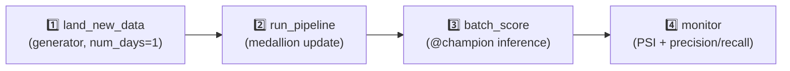

The dependency edges are doing safety work: if the pipeline fails, scoring
**never runs** — so you can't score on stale data. Failure scenario, start to
finish: task 2 dies on a quota limit → tasks 3–4 are skipped, a failure email
fires (configured in `databricks.yml`), you fix the cause and hit **Repair
run** — which re-executes *only* tasks 2–4 with the original run's parameters.
No duplicate data from re-running task 1, no manual bookkeeping. (That
end-to-end story is playbook 1 in the RUNBOOK.)

### 4.2 Infrastructure as code: Asset Bundles

Clicking a job together in the UI works — once. Then: how do you review a
change to it? Recreate it after an accident? Keep dev and prod in sync? UI
state answers none of these. A **Databricks Asset Bundle** moves the
definitions into a YAML file *in git*:

```yaml
resources:
  jobs:
    daily_fraud_job:
      schedule: { quartz_cron_expression: "0 30 5 * * ?" }
      email_notifications: { on_failure: ["you@example.com"] }
      tasks:
        - task_key: land_new_data
        - task_key: run_pipeline
          depends_on: [{ task_key: land_new_data }]
        # ...
```

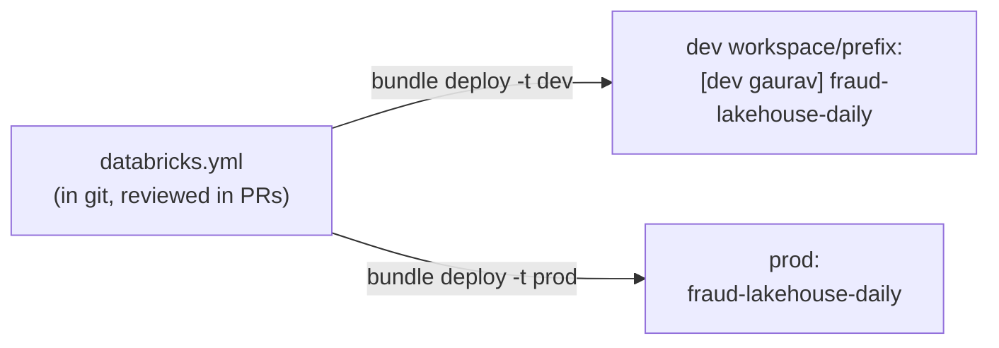

Now a schedule change is a diff someone approves; environments are the same
file deployed to different targets; and disaster recovery is `git clone` +
`bundle deploy`. Same idea as Terraform, scoped to Databricks resources.

**In this project:** `databricks.yml` defines the pipeline, the daily job and
the weekly retrain. SETUP.md shows both paths (UI for the first run, bundle
for the real one).

### 4.3 CI & the runbook

- **CI** (`.github/workflows/ci.yml`): every push is linted, syntax-checked,
  and bundle-validated *before* it reaches a workspace. The principle: broken
  code should fail in a pull request, where it costs seconds — not in the
  05:30 job, where it costs a missed day and an on-call page.
- **Runbook** ([RUNBOOK.md](RUNBOOK.md)): playbooks for the seven ways this
  system fails, written *before* any of them happened. When the quarantine
  spikes at 9am, the on-call person follows numbered steps instead of
  improvising under pressure. Writing playbooks in calm weather is itself the
  senior skill this project showcases — the code is half the system; knowing
  what to do when it breaks is the other half.

---

## Quick glossary

| Term | One-liner |
|---|---|
| Lakehouse | Cheap open files + transaction layer = warehouse reliability at lake cost |
| Delta Lake | Parquet + commit log → ACID tables, schema enforcement, time travel, MERGE |
| Unity Catalog | Governance tree: `catalog.schema.object` for tables, files *and* models |
| Volume | UC-governed folder for raw files (our JSONL landing zone) |
| Serverless | Compute appears on demand; zero cluster configuration |
| Medallion | Bronze (raw, replayable) → Silver (valid, deduped) → Gold (per-consumer aggregates) |
| Auto Loader | Checkpointed file ingestion — each file exactly once, forever |
| Rescued data | Schema-misfit values preserved in `_rescued_data` instead of crashing the pipeline |
| Watermark | "Duplicates arrive within X" → bounded streaming state; explicit lateness assumption |
| Declarative pipeline | Define tables; the framework derives the DAG, ordering and checkpoints |
| Expectation | Named quality rule on a table; hard = drop (to quarantine), soft = count |
| Quarantine | Rejected rows + reasons — visible loss instead of silent loss |
| Materialized view | Pay at write time, serve cheap at read time |
| Feature | Domain knowledge encoded as a number (velocity, spend-vs-history, new device…) |
| Leakage | Training on information unavailable at prediction time; windows end at −1 to prevent it |
| Time split | Train on the past, test on the future — the only honest split for fraud |
| Precision / Recall | Alert quality / fraud coverage — the pair that replaces (useless) accuracy |
| PR-AUC | The precision-recall trade-off summarized across all thresholds |
| Precision@200 | Precision within the daily analyst budget — a metric tied to a real constraint |
| Registry alias | `@champion` pointer → promote/rollback = move pointer, zero code change |
| Champion/challenger | New model promoted only on a measured win over the incumbent |
| Idempotent | Safe to rerun; MERGE-keyed writes make backfills harmless |
| PSI | One number for "how far has this distribution moved"; >0.2 = investigate |
| Asset Bundle | Jobs/pipelines as reviewed, deployable YAML in git |
| Runbook | Incident playbooks written before the incident |
