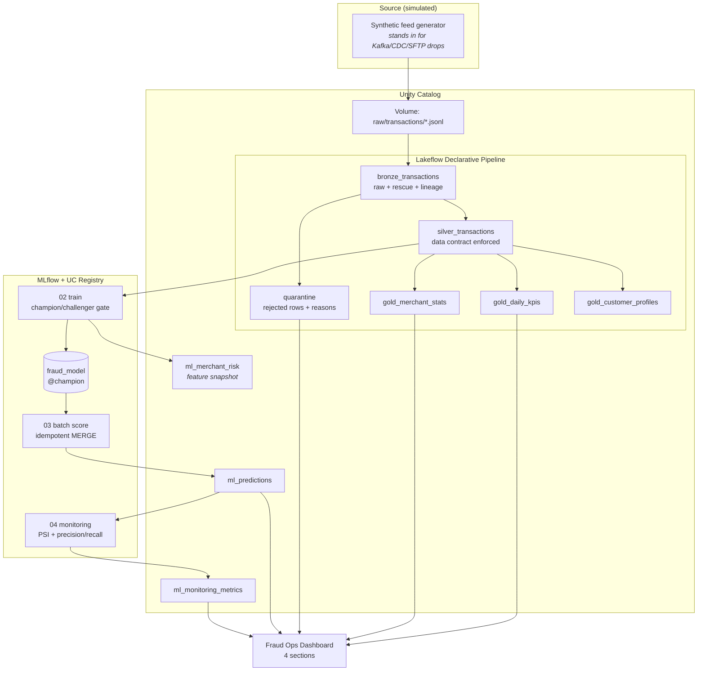

# Architecture

## System overview

The project implements the standard FSI fraud-analytics lakehouse: an incremental
file feed lands in object storage (a UC Volume here), flows through a medallion
pipeline into governed Delta tables, feeds both BI and ML consumers, and closes
the loop with model monitoring.

## Layer contracts

### Bronze — `bronze_transactions`
*Promise: nothing is lost; everything is replayable.*
Raw JSON as landed via Auto Loader. Schema inferred, incompatible values rescued
into `_rescued_data` rather than failing the pipeline. Every row carries
`_source_file` and `_ingested_at` for lineage and reprocessing.

### Silver — `silver_transactions`
*Promise: typed, valid, unique. The contract all consumers rely on.*

| Column | Type | Rule |
|---|---|---|
| transaction_id | STRING | PK; NOT NULL (hard); deduplicated within a 2-day watermark |
| event_ts | TIMESTAMP | NOT NULL (hard) |
| customer_id | STRING | NOT NULL (hard) |
| amount | DOUBLE | NOT NULL AND > 0 (hard) |
| merchant_id / merchant_category | STRING | soft expectation (nullable, tracked) |
| currency | STRING | soft expectation: USD |
| country, device_id, channel | STRING | as landed |
| is_fraud, fraud_type | INT / STRING | confirmed-fraud label feed (arrives delayed in real life) |

Hard-rule failures are **quarantined, not dropped silently** — see
`silver_transactions_quarantine` with `_quarantine_reason`, trended on the dashboard.

### Gold
Business-level materialized views, one per consumer question: daily KPIs
(executives), merchant stats (merchant risk), customer profiles (behavior analytics).

## ML design

- **Point-in-time features** (`notebooks/_features.py`): every feature uses only
  data strictly before the transaction. Velocity windows (`1h`, `24h` counts),
  spend-vs-own-history ratio, new-device and foreign-country flags, seconds since
  previous transaction, and a Laplace-smoothed merchant fraud rate computed on the
  training window only.
- **One feature implementation** shared by training and scoring via `%run` —
  eliminating training/serving skew by construction.
- **Time-based split** (train days 1–24, test 25–30): random splits leak
  fraud-episode structure across the boundary and inflate metrics.
- **Metrics chosen for a 0.4% positive rate**: PR-AUC, recall at 0.5% FPR, and
  precision within the top-200 daily alerts (the analyst budget). Accuracy is
  meaningless here and deliberately not reported.
- **Champion/challenger**: every training run registers a version (auditability);
  the `@champion` alias moves only on a measured win over the incumbent on the
  identical test window. Scoring resolves the alias, never a version number, so
  rollback is a one-line alias re-point.
- **Monitoring**: daily PSI of the score distribution against a training-time
  baseline snapshot, plus alert precision / fraud recall as labels arrive.

## Operational properties

| Property | Mechanism |
|---|---|
| Idempotent ingestion | Auto Loader checkpoints; generator skips existing day files |
| Idempotent scoring | MERGE on transaction_id; safe to rerun/backfill any day |
| Replayability | Bronze retains raw; pipeline supports full refresh |
| Auditability | Model version + scored_at on every prediction; all versions registered |
| Failure isolation | Job tasks are sequential with dependencies; one day's failure never corrupts prior days |
| Data-quality visibility | Expectations metrics in pipeline event log + quarantine table on dashboard |

## What changes at real production scale

Honest deltas between this free-tier build and the same system at a bank:

1. **Ingestion**: Kafka / CDC (Debezium, Lakeflow Connect) instead of file drops;
   Bronze becomes a streaming table fed continuously.
2. **Latency**: card fraud needs sub-second *authorization* scoring — that layer
   lives in an online feature store + low-latency serving (Model Serving /
   feature serving endpoints), while this batch lakehouse remains the
   *detection/review/retraining* backbone. Both exist in real deployments.
3. **Labels**: chargeback/investigation feeds arrive days late — training joins
   labels with an as-of watermark rather than reading them off the transaction.
4. **Scale**: partitioning/liquid clustering on event date, table optimization
   schedules, and streaming gold aggregations become material at billions of rows.
5. **Governance**: row/column-level security on cardholder data (PCI), grants per
   persona (analyst vs. data scientist vs. service principal), audit logs, and
   separate dev/staging/prod workspaces deployed by CI from the same bundle.
